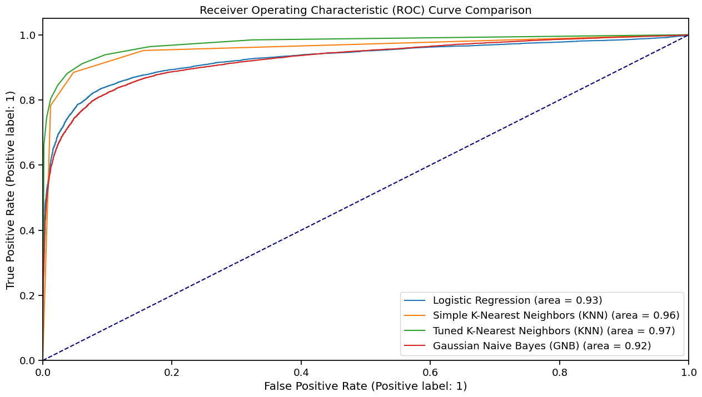

# Portfolio 4: Analysis of Airline Passenger Satisfaction

## Project Description
This project is Portfolio 4, part of the COMP6200 Data Science unit. In contrast to previous portfolios, this project is conducted independently, encompassing all aspects from data selection to problem definition and solution development. The dataset used for this analysis is sourced from Kaggle and focuses on `Airline Passenger Satisfaction`.

## Introduction
In the fiercely competitive airline industry, passenger satisfaction emerges as a critical determinant of an airline’s success. With millions flying daily, understanding and enhancing the passenger experience is paramount. This project utilizes a comprehensive dataset of over 120,000 passenger reviews to explore the factors influencing satisfaction. By applying data analytics and machine learning techniques, we aim to identify the key patterns and provide insights into passenger satisfaction within the airline industry.

Image source: [World Airline Star Rating](https://skytraxratings.com/about-airline-rating)

## Tools and Libraries Used
- **Jupyter Notebook**
- **Python**
  - `pandas`
  - `numpy`
  - `seaborn`
  - `matplotlib`
  - `plotly`
  - `scikit-learn`
  - `scipy`

## Project Tasks

### 1. Data Preparation
#### Load Data and Data Overview
- Load the dataset from `Airline Quality Ratings.csv` using pandas.
- Check the total length of the dataset.

#### Exploratory Data Analysis
- Identify categorical and numerical columns.
- Perform univariate and bivariate analysis to understand the distribution and relationships in the data.
- Visualize the distributions and relationships using plots.

#### Data Cleaning and Encoding
- Check for NULL values and handle them appropriately.
- Convert categorical variables to numerical values using encoding techniques.

#### Correlation Analysis
- Calculate and plot the correlation matrix.
- Identify features with high correlation to the target variable `Satisfaction`.

### 2. Model Preparation and Setup
#### Data Splitting and Scaling
- Split the dataset into training (80%) and testing data (20%) using stratified sampling to handle class imbalance.
- Use `RobustScaler` to scale the features while handling outliers.

#### Model Preparation
- Create a comprehensive function to prepare and evaluate models.

### 3. Train and Evaluate Models
#### Simple Logistic Regression
- Train a logistic regression model and evaluate its performance on training and test sets.

#### K-Nearest Neighbors (KNN)
- Train a KNN model with an arbitrary K value.
- Tune the hyperparameter K using `GridSearchCV`.
- Train the final KNN model with the best K value and evaluate its performance.

#### Gaussian Naive Bayes (GNB)
- Train a Gaussian Naive Bayes model and evaluate its performance.

### 4. Model Comparison
- Compare the performance of all models using metrics such as accuracy, balanced accuracy, F1 score, and ROC AUC score.
- Visualize the ROC curves for all models.

## Findings

### Data Overview
- Length of the data: 129880
- Categorical Columns: ['Gender', 'Customer Type', 'Type of Travel', 'Class', 'Satisfaction']
- Numerical Columns: ['Age', 'Flight Distance', 'Departure Delay', 'Arrival Delay', 'Departure and Arrival Time Convenience', 'Ease of Online Booking', 'Check-in Service', 'Online Boarding', 'Gate Location', 'On-board Service', 'Seat Comfort', 'Leg Room Service', 'Cleanliness', 'Food and Drink', 'In-flight Service', 'In-flight Wifi Service', 'In-flight Entertainment', 'Baggage Handling']

### Exploratory Data Analysis
#### Numerical Variables
- **Age**: The age distribution is concentrated primarily in the 30-50 age group.
- **Flight Distance**: The majority of flights have distances under 1000 km.
- **Departure and Arrival Delays**: Most flights are not delayed, but there are some significant outliers with long delays.

#### Categorical Variables
- **Passenger Types and Travel Purposes**: Most passengers are frequent flyers, and a significant proportion travel for business purposes compared to personal trips.
- **Class Distribution**: The majority of passengers opt for Business and Economy Class, while the number of passengers using Economy Plus is less than 10,000.
- **Service Ratings**: Most services are rated around 4, with the exception of online booking services which receive lower ratings.

#### Satisfaction Distribution
- **Satisfaction Levels**: Among the surveyed passengers, 56,428 expressed satisfaction with their flight, while 73,452 reported neutral or dissatisfied attitudes.
- **Proportion**: The proportion distribution is 56.6% for "Neutral or Dissatisfied" (negative class: 0) and 43.4% for "Satisfied" (positive class: 1).

#### Further Analysis by Categories
- **Gender**: While the number of satisfied male and female passengers was roughly equal, there were slightly more females than males who reported feeling neutral or dissatisfied.
- **Customer Type**: First-time customers had significantly lower satisfaction rates compared to returning customers.
- **Type of Travel**: Customers on personal travel expressed lower satisfaction levels compared to those traveling for business purposes.
- **Class**: A satisfied experience was notably more prevalent among Business Class travelers compared to passengers flying Economy Class and Economy Plus.

### Data Cleaning and Encoding
- Dropped rows with missing values in the _Arrival Delay_ column.
- Encoded categorical variables to numerical values.

### Correlation Analysis
- Features most positively correlated with `Satisfaction`: _Online Boarding_, _Class_, _Type of Travel_, _In-flight Entertainment_.
- Features with negative correlations: _Departure Delay_, _Arrival Delay_, _Departure and Arrival Time Convenience_.

### Model Performance
#### Simple Logistic Regression
- **Training Accuracy**: 0.873867
- **Test Accuracy**: 0.875241

#### K-Nearest Neighbors (KNN)
- **Initial KNN (K=3) Test Accuracy**: 0.922890
- **Tuned KNN (K=9) Test Accuracy**: 0.926944

#### Gaussian Naive Bayes (GNB)
- **Test Accuracy**: 0.865241

### Model Comparison
| Model | Test Set Accuracy | Test Set Balanced Accuracy | Test Set F1-Score | Test Set ROC AUC |
|-------|--------------------|----------------------------|-------------------|------------------|
| Logistic Regression | 0.875241 | 0.871196 | 0.854085 | 0.925594 |
| Simple KNN (K=3) | 0.922890 | 0.918462 | 0.908842 | 0.957465 |
| Tuned KNN (K=9) | 0.926944 | 0.921635 | 0.912899 | 0.974270 |
| Gaussian Naive Bayes | 0.865241 | 0.860645 | 0.841867 | 0.923395 |

### ROC Curve (AUC) Comparison
The Tuned KNN model demonstrates the best overall performance, followed by the Simple KNN model, Logistic Regression, and Gaussian Naive Bayes.

## Contributing

As this is an individual assignment, I am the main contributor. However, if you find any errors or areas of improvement, feel free to create an issue or submit a pull request.

## License
This project is part of a university assignment, and the dataset is sourced from Kaggle. Please use this for reference or educational purposes only.

**Reference:** 
- MIKHAIL, Kaggle, [Airline Quality Ratings: Passenger Reviews of Airlines & Airline Passenger Satisfaction](https://www.kaggle.com/datasets/mikhail1681/airline-quality-ratings/data).

